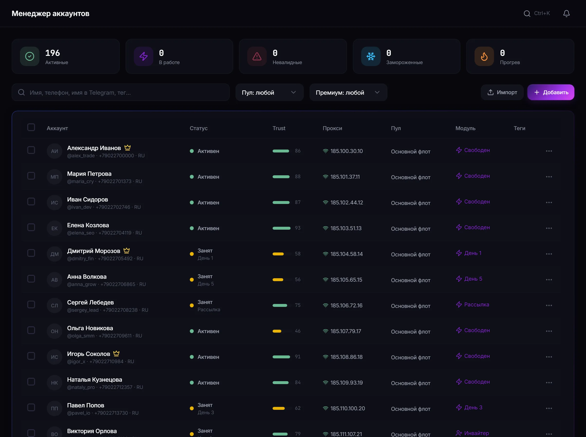

# Менеджер Telegram-аккаунтов в TeleTraff

Менеджер аккаунтов — инвентарь всего парка: какие аккаунты есть, в каком они состоянии, какой прокси у каждого и кто сейчас занят задачей.

**[Полное руководство →](https://teletraff-guides.github.io/modules/account-manager/)**  ·  **[Официальная страница модуля →](https://teletraff.com/ru/modules/account-manager)**

---

## Кратко о модуле

| Параметр | Значение |
| --- | --- |
| Статус | наблюдаемое состояние на стороне Telegram, а не желаемое |
| Занятость | один аккаунт не ведёт две конфликтующие задачи |
| Фильтры | по состоянию, пулу, премиуму и занятости |
| Пакетные действия | над выбранной группой без открытия каждого |

## Минимальный сценарий настройки

1. Импортируйте аккаунты в панель.
2. Сразу назначьте прокси — до первого действия в Telegram.
3. Заполните профиль: имя, аватар, описание.
4. Прогрейте и только потом ставьте на рабочие модули.

## Интерфейс модуля

## Ограничения и правила платформы

- Панель показывает состояние, но не управляет решениями Telegram.
- Ограничение платформы не снимается настройками задачи.
- Профиль аккаунта панель за вас не заполняет.

## Частые ошибки

| Ситуация | Что происходит |
| --- | --- |
| Аккаунт не выбирается в задачу | он занят другой задачей или у него нет прокси |
| Статус изменился сам | так платформа отразила своё решение по аккаунту |
| Часть выборки не пошла в работу | не учтена колонка занятости |

## Связанные модули

- [Прокси-центр](https://github.com/teletraff-guides/telegram-proxy-manager-teletraff)
- [Пулы аккаунтов](https://github.com/teletraff-guides/telegram-account-pools-teletraff)
- [Прогрев аккаунтов](https://github.com/teletraff-guides/telegram-account-warmup-teletraff)

## Документация

- [Полное руководство по модулю](https://teletraff-guides.github.io/modules/account-manager/)
- [Каталог всех модулей](https://teletraff-guides.github.io/modules/)
- [Диагностика запусков](https://teletraff-guides.github.io/troubleshooting/)
- [Ответственное использование](https://teletraff-guides.github.io/responsible-use/)

---

TeleTraff (ТелеТрафф) — независимый сервис. Он не принадлежит Telegram, не аффилирован с Telegram FZ-LLC
и не является официальным продуктом мессенджера. Telegram — товарный знак своего правообладателя.
